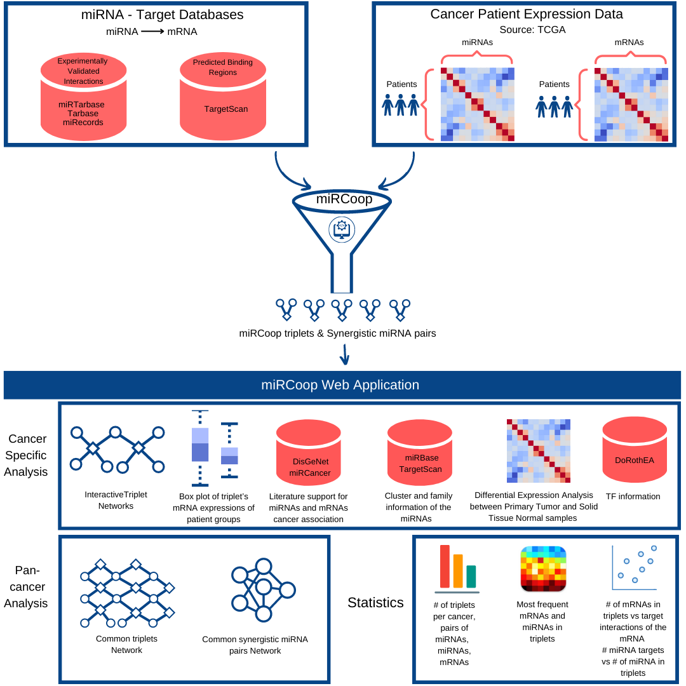

miRCoop v2
===================================

`miRCoop <https://ieeexplore.ieee.org/document/9311836>`_, is a method that finds potentially synergistic pairs through kernel interaction tests on matched gene expression levels of mRNAs and miRNAs. Now, we present an updated miRCoop pipeline, miRCoop v2, a faster version with a 30 speed up in runtime, which allowed us to apply it on 31 different TCGA cancers. The candidate cancer triplets, the synergistic miRNA pairs and their common targets,  are presented in `miRCoop web application <http://mircoop.sabanciuniv.edu>`_ to make our results available to the public. 

  Figure 1. General miRCoop and miRCoop Web Application pipeline

Check out the :doc:`usage` section for further information, including
how to :ref:`installation` the project.

.. note::

   This project is under active development.

Contents
--------

.. toctree::

   methods
   dataset
   miRCoop Web Application
