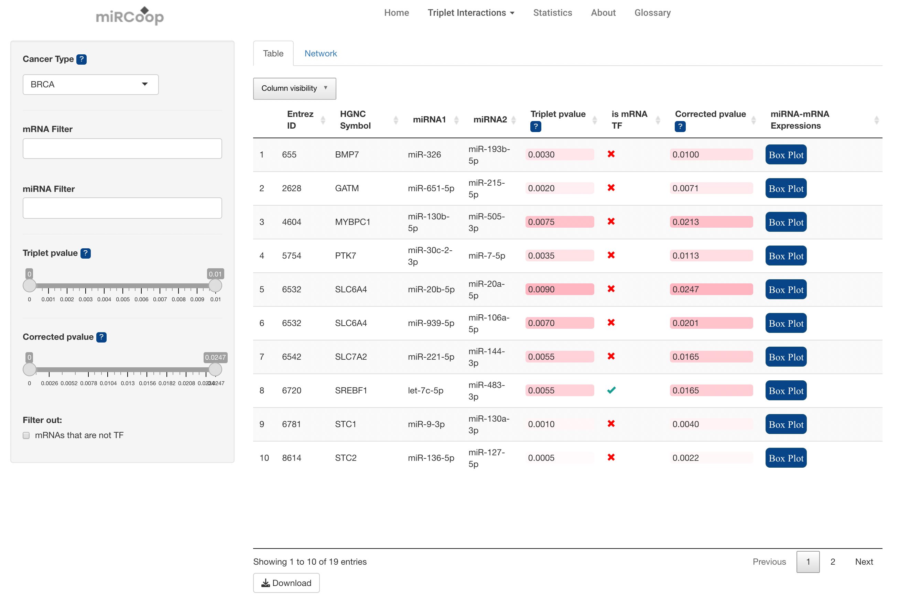
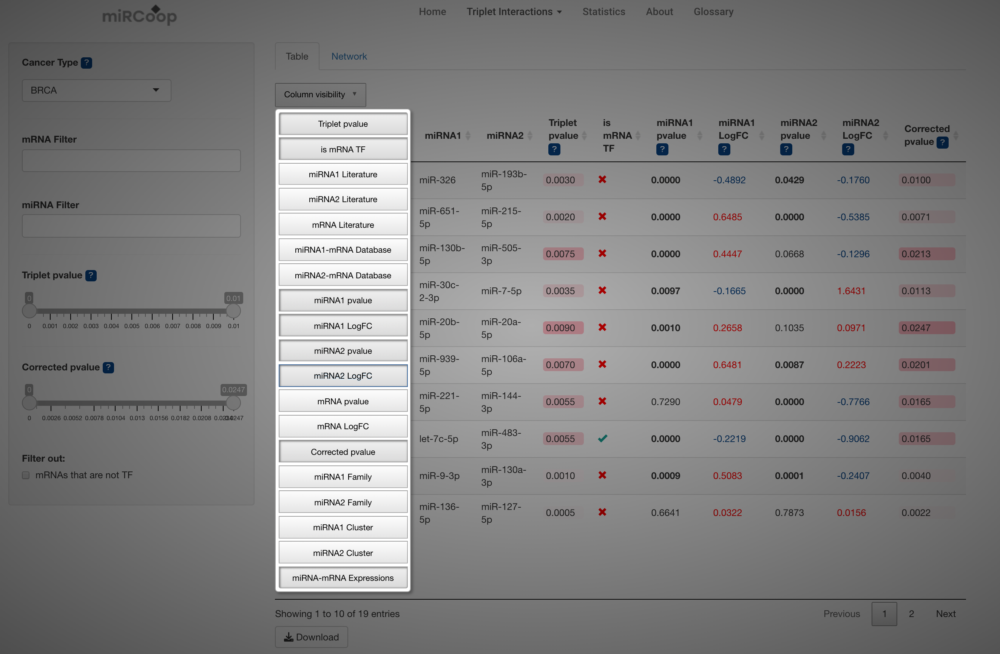

Cancer Specific Analysis
========
Predicted triplets can be investigated here. First, one of the 31 different cancer types included in the study is selected from the cancer type section. After the 'cancer type' is selected in the left panel, the miRCoop triplets and synergistic miRNA pairs identified for that cancer are presented to the user in the main panel.

  Figure 1. Main panel for triplets. Here BRCA is selected as the cancer type.
  
The datatable essentially builds on the identified triplets, miRNA pairs and their target mRNA, which is represented with both HGNC symbol and Entrez Gene ID, triplet p-values and corrected p-values with the Benjamini Hochberg procedure. The data has been enriched with the following additional information: experimental data source of miRNA and mRNA relationships, differential expression analysis results, literature support of cancer-miRNA and cancer-mRNA relationship, mRNA expressions of patients grouped by miRNA expression levels and transcription factor information. This additional information can be added to datatable from 'Column visibility' part. 

