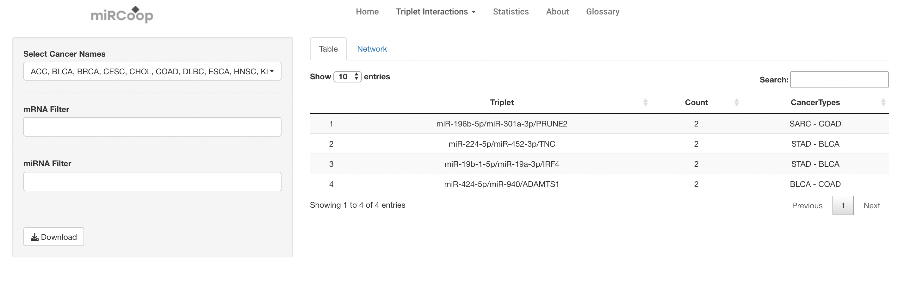
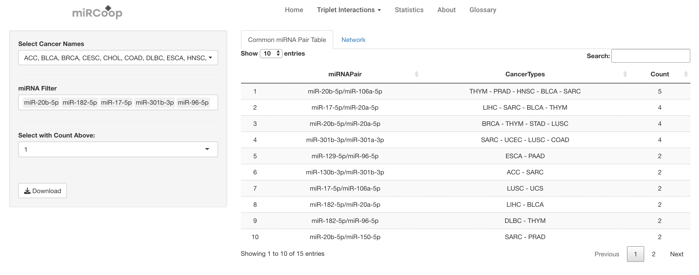
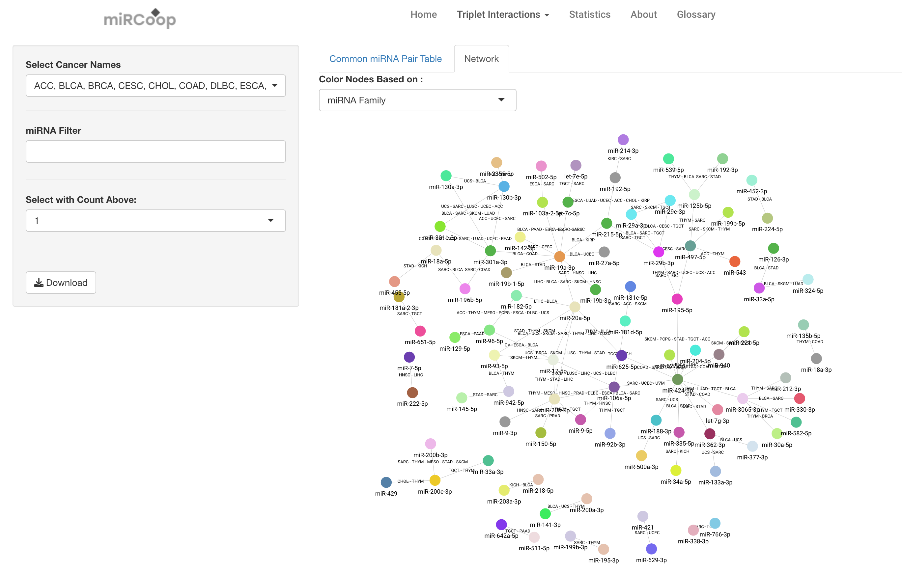

Pan-cancer Anaysis
========
Users can view pan-cancer miRNA pairs and pan-cancer miRCoop triplets via selecting the respective sections. Filtering based on cancer type, number of cancer count, miRNA and mRNA for pairs and triplets can be performed from the left side panel. 

  Figure 1. Main panel for Pan-cancer Triplets. 
  

  Figure 2. Main panel for Pan-cancer synergistic miRNA pairs. Filtering is applied with miRNAs and pairs that are common in more than 3 cancers.  

Here, interactive networks of pan-cancer miRNA pairs and triplets can be generated with network tab like in the Cancer Specific Triplets section. 

