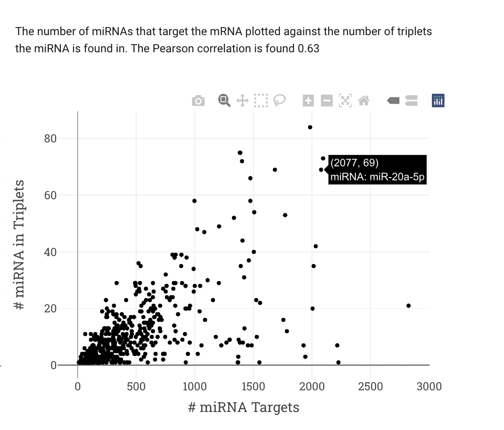

Statistics
========
Users can view some statistics regarding the dataset and results. Counts across all cancer types (number of triplets in each cancer, the number of unique miRNA pairs that participate in these triplets, number of unique miRNAs in the triplets, number of unique mRNAs) is shown with bar graph. When user hovers the mouse, s/he can see the numbers explicitly.

.. figure:: ../../figures/stats/1_1.png
  :width: 700
  :alt: My Text

  Figure 1. Total counts for all cancer types. 

The distribution of miRNAs and mRNAs, which have a higher overall frequency than others was examined in order to analyse whether these miRNAs and mRNAs are seen in a specific cancer or are distributed in multiple different cancer types. miRNAs and mRNAs that have total participation more than 30 and 15 in all miRCoop triplets are shown in Figures respectively. Values are normalised with the total number of triplets in cancer. 

  Figure 2.
  

  Figure 3.

The number of miRNA targets and the number miRNA existence in triplets, the number of miRNAs in triplets in all cancers and the number of miRNA targets are represented to the users. 

  Figure 4.
  
  The number of mRNAs in triplets in all cancers and the number of mRNA-target interactions are also presented to the users. 
  

  Figure 5.
  
